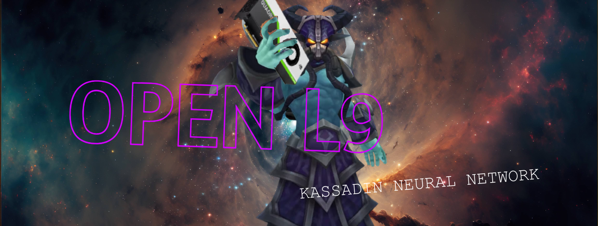

# OpenL9
A free and open source specialized ML model for analyzing Kassadin gameplay that gives you feedback.

Built upon cutting-edge RiftWalk™ technology

A stupid but ambitious project to learn image recognition in Python.

Read more below.

Initial thoughts:

1. get data from Riot API | 2. design and write NN | 3. train | 4. deploy using Overwolf framework

TODO:
Study to use Riot API
